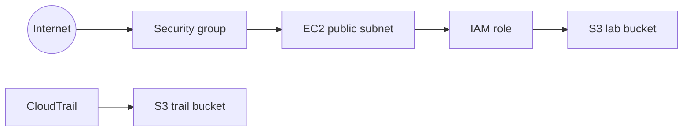

# Architecture

## Components

| Resource | Purpose |
|----------|---------|
| VPC | Isolated network for the lab |
| Public subnet | Hosts EC2 with a route to the internet |
| Internet gateway + route table | Outbound/inbound internet for the public subnet |
| EC2 | Runs Apache and uploads a sample object to S3 via instance role |
| Security group | Allows HTTP (80); SSH (22) is restricted or open depending on `lab_mode` |
| S3 (lab bucket) | Stores `sample.txt`; public access only in `insecure` mode |
| IAM role + instance profile | Grants EC2 least-privilege S3 access, or `s3:*` on `*` in insecure mode |
| S3 (CloudTrail logs) | Receives trail log objects from CloudTrail |
| CloudTrail | Records management API activity in the account |

## Flow

## Modes (`lab_mode`)

- **baseline** / **remediated**: SSH limited to `my_ip_cidr`, S3 Block Public Access on, no public bucket policy, scoped IAM S3 policy.
- **insecure**: SSH `0.0.0.0/0`, public read bucket policy, IAM `s3:*` on `*`.
